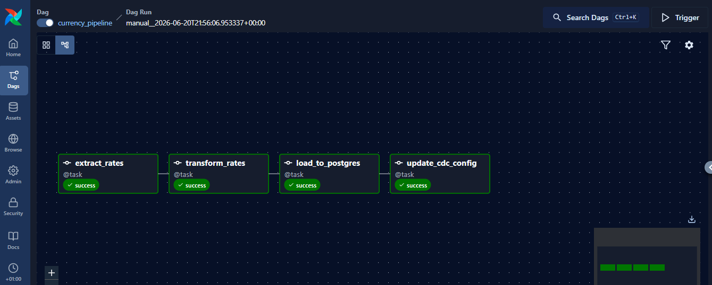

# Currentaly Exchange Rate Pipeline

A daily ETL pipeline built with **Apache Airflow** that extracts live currency exchange rates, transforms them, and loads them into PostgreSQL - with idempotent (duplicate-safe) loading and a JSON-based CDC config.

## Architecture

Frankfurther API -> Extract -> Transform -> Load (Postgres) -> Update CDC Config

## Tech Stack

- **Apache Airflow 3.2** (orchestration)
- **Docker & Docker Compose** (containerization)
- **PostgreSQL** (data storage)
- **Python** (psycopg2, requests)
- **Frankfurther API** (free exchange rate data)

## Pipeline Tasks

1. **extract_rates** - Calls the frankfurther API for the exchange date's rates
2. **transform_rates** - Filters to target currencies (config-driven via JSON)
3. **load_to_postgres** - Upserts records using `ON CONFLICT` (no duplicate on re-run)
4. **update_cdc_config** - Tracks last successful run in `cdc_config.json`

## Pipeline Run



## Key Engineering Decisions

- **Idempotency**: Unique constraint on (date, base, currency) with `ON CONFLICT DO UPDATE` - running the DAG twice for same date never creates duplicates.
- **Retries**: Each task retries up to 3 times with delay, handling transient API/network failures.
- **Transaction safety**: Table creation is committed separately from inserts, with rollback on failure - prevents partial writes.
- **CDC tracking**: A simple JSON config tracks pipeline state, making it easy to audit what ran and when, without needing a separate metadata table.
- **Templating/Kwargs**: Uses Airflow's `ds` context variable so the pipeline automatically processes the current execution date - no hardcoded dates.

## How To Run

```bash
docker compose up airflow-init
docker compose up -d

Visit http://localhost:8080 (airflow/airflow), trigger
currency_pipeline.
```

## Challenges Solved

- Fixed a transaction rollback bug where a failed INSERT was silently undoing the CREATE TABLE statement
- Implemented UPSERT logic to handle pipeline re-runs safely
